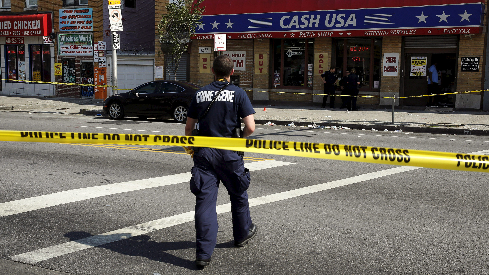
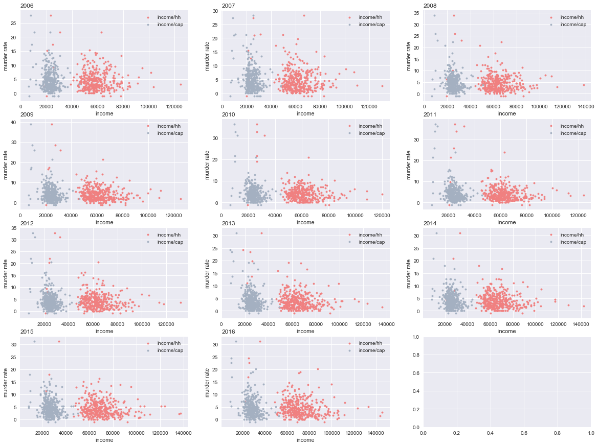
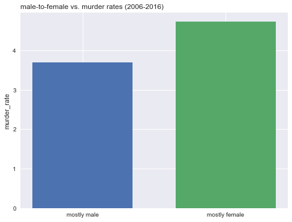

<!-- This is the home page -->

<!-- ## Lets have fun -->

<!-- >here is a quote

Here is *emph* and **bold**.

Here is some inline math $\alpha = \frac{\beta}{\gamma}$ and, of-course, E rules:

$$ G_{\mu\nu} + \Lambda g_{\mu\nu}  = 8 \pi T_{\mu\nu} . $$ -->
### Group 10 - Anesta Iwan and Vivek HV ###

## Problem Statement and Motivation
**Data analysis in crime is not news.** Agencies around the world have used data in various ways to understand, get insights and eventually predict crime.  

Yet we have also come to acknowledge issues with these new techniques. The datasets have mirrored human biases and we continue to see correlations which make very little sense.  

Our motivation is, therefore, to better understand the context of crime in the US. We would like to combine data from multiple sources in a hope to prove/disprove possible correlations. We hope that this work can help start conversations about these issues and understand whether the context of a geography is correlated to crime within its boundaries.  

## Introduction and Description of Data
Our data comes from the following main sources: 
1. FBI Uniform Crime Reporting Database 
2. American Fact Finder - US Census Data 
3. Bureau of Alcohol, Tobacoo, Firearms and Exposives - US Firearms Data 
We have identified a few basic criteria including the demographic range in age, gender, and race. Additionally, we also hypothesize that marital status, income, and educational attainment of the given population may have an impact on the way people behave and/or commit crimes. We’ve also looked into external sources to find the total number of firearm licenses issued within each state to find additional correlation between crime rates and the availability of firearms. 
We have scraped the FBI website for the total numbers of reported violent crimes in each Metropolitan Statistical Area (within the U.S. and Puerto Rico) across 2006 to 2016. 

## Questions:
Our questions derive from our Literature Review (below):
1. Is there a direct correlation between high population density and crime rates? 
2. Is there a correlation between high crime rates and high density of a certain race, age group, or gender? 
3. Would an area populated with higher marital rates have lower crime rates? Or would an area populated with widowed or divorced population have higher crime rates? 
4. Would a higher educated population lead to higher or lower crime rates? 

## Literature Review/Related Work
**Marriage and Crime**
In an article we found around marriage and crime rates, the author mainly discusses the social/cultural effects of crime rates.  
Forrest, Walter. “Marriage Helps Reduce Crime.” The Conversation. Accessed December 7, 2017. [Marriage and Crime](http://theconversation.com/marriage-helps-reduce-crime-3576)

**Real Estate and Crime**
In an article we found around marriage and crime rates, the author mainly discusses the social/cultural effects of crime rates. 
Forrest, Walter. “Marriage Helps Reduce Crime.” The Conversation. Accessed December 7, 2017. [Real Estate and Crime](http://theconversation.com/marriage-helps-reduce-crime-3576)

**Firearms and Crime**
In an article we found around marriage and crime rates, the author mainly discusses the social/cultural effects of crime rates. 
Forrest, Walter. “Marriage Helps Reduce Crime.” The Conversation. Accessed December 7, 2017. [Firearms and Crime](http://theconversation.com/marriage-helps-reduce-crime-3576)

**Income, Education and Crime**

>Murder rates usually take higher values at lower incomes per capita and per household
In an article we found around marriage and crime rates, the author mainly discusses the social/cultural effects of crime rates. 
Forrest, Walter. “Marriage Helps Reduce Crime.” The Conversation. Accessed December 7, 2017. [Income, Education and Crime](http://theconversation.com/marriage-helps-reduce-crime-3576)

**Male to Female ratio**

>Initial EDA pointed us to a possibility that a higher female to male ratio happens to correlate with higher murder rates.

## Modeling Approach and Project Trajectory
Since murder rate is a continuous variable, we’ve decided to conduct a linear regression rather than a logistic regression. We’ve used the basic linear regression as our baseline model. 
For our models, we’ve used cross-validated ridge and lasso models. Additionally, we’ve also modeled the linear regression, lasso, and ridge with polynomial features upto degree 2. Since we’ve found some collinearity between some of our predictors, we’ve also ran the linear, lasso, and ridge with interaction terms. In all of the models (other than the baseline), we’ve conducted the models with cross validation to further better our models on train and test sets.

## Complications and Headhurters ##
1. Some of the complications we’ve faced include inconsistent MSA names across different years.  
2. There were a significant amount of data that was missing from the census data that needed to be imputed. Some of the data sets found on the census bureau website were missing Puerto Rico. 
3. Added complications came from overlapping data (i.e. data sets including two or more characteristics that are also present 

## Results, Conclusions, and Future Work ##

We found that the Lasso model used on top of polynomial features performed the best on the test set. 
Some of the significant features that were found in these models:
1. **Race - Black and White:**
    Race continues to be correlated strongly with crime in the US. Whether this holds a mirror to the bias is a deeper conversation and question and it needs to be asked. If we had more time, we would consider doing further research on the effect of bias in datasets like these.
2. **Education and Income:**
    Education and Income are also correlated with crime in the US. But the level of educaton in a community is not representative of the crime in the society. Further investigation is necessary to get more conclusive results.
3. **Marital Status**:
    Similar to education and income, marital status is correlated with crime (statistically significant). Whether this means any sort of causation is to be investigated.
4. **Firearms**:
    An interesting result was the value of the coefficient associated with features corresponding to firearms in MSA's. Though correlated significantly, it is much lower than most of the other featuress.